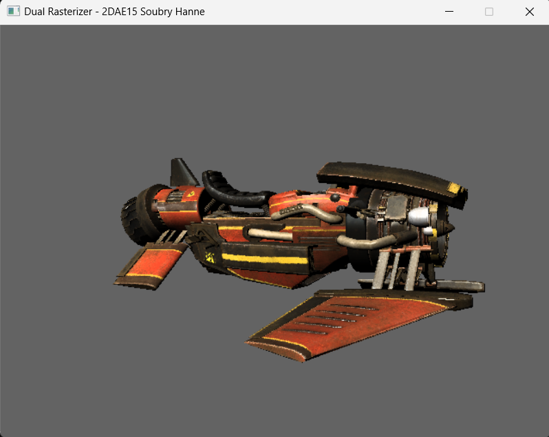
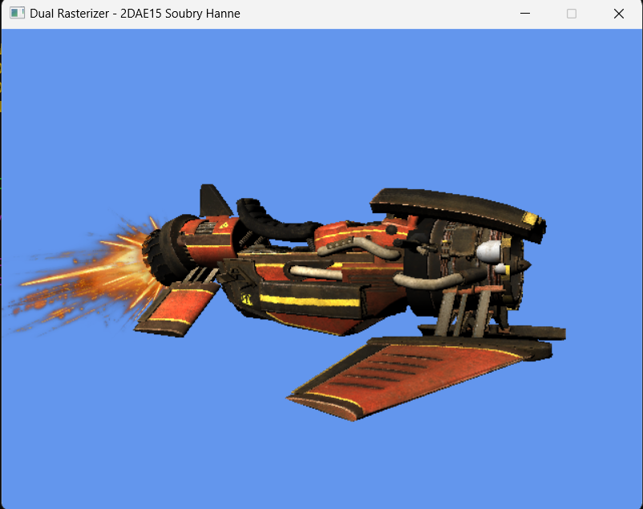

# GP1_Dual_Rasterizer

This is an assignment for the course Graphics Programming in DAE. 

We received a c++ framework with minimal functionality and used this to create a rasterizer, from processing the model information to outputting it on the screen.

We started with a software version first to get a better understanding of how the process works. 
Of course the software version is not optimized which causes a low framerate and this one does not support transparency and effects.

Next we created a hardware version to compare with the efficiency of the gpu. 
This one has a much higher framerate and includes an implementation of transparency effects.

This project contains both and can switch between software and hardware at runtime to see the difference. 
The sofware version has a gray background and the hardware one has a blue background to easily know in which mode is currently active.
